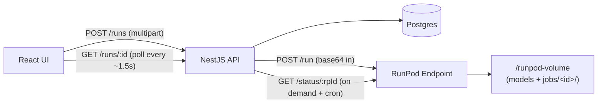

# Image-to-Blueprint — RunPod Serverless + Web Client Plan

## 1. Architecture overview



- One RunPod endpoint, one handler, models loaded once at container init (kept warm via FlashBoot).
- Network volume holds all weights and per-job outputs; container image is lightweight.
- NestJS submits jobs with `/v2/<endpoint>/run` (returns a RunPod job id immediately). It then reconciles status by calling `/v2/<endpoint>/status/<id>` whenever the React client polls a Run that is still in flight, plus a small periodic sweep as a backstop. No queue/Redis needed for the POC.

## 2. Repo layout (additive — leaves existing root Python untouched)

- [worker/](worker/) — RunPod serverless handler, Dockerfile, requirements
- [worker/scripts/provision_volume.py](worker/scripts/provision_volume.py) — manifest-driven model installer
- [worker/manifest.json](worker/manifest.json) — single source of truth for model files + sources + sha256
- [apps/api/](apps/api/) — NestJS service (Prisma + Postgres)
- [apps/web/](apps/web/) — React (Vite) client
- [docker-compose.dev.yml](docker-compose.dev.yml) — Postgres only (POC, no Redis/queue)
- The existing pipeline modules (`model_utils.py`, `fp8_loader.py`, `pipeline_utils.py`) are imported by the worker via `PYTHONPATH`. No moves required.

## 3. Model provisioning (best practice for HF + non-HF mix)

**Single declarative manifest** — `worker/manifest.json`:

```json
{
  "volume_root": "/runpod-volume",
  "files": [
    { "dest": "models/text_encoders/qwen_2.5_vl_7b_fp8_scaled.safetensors",
      "source": { "kind": "hf_file", "repo": "Comfy-Org/HunyuanVideo_1.5_repackaged",
                  "path": "split_files/text_encoders/qwen_2.5_vl_7b_fp8_scaled.safetensors" },
      "sha256": "…" },
    { "dest": "models/vae/qwen_image_vae.safetensors",
      "source": { "kind": "hf_file", "repo": "Comfy-Org/Qwen-Image_ComfyUI",
                  "path": "split_files/vae/qwen_image_vae.safetensors" } },
    { "dest": "models/unet/qwen-image-edit-2511-Q3_K_M.gguf",
      "source": { "kind": "url",
                  "url": "https://huggingface.co/unsloth/Qwen-Image-Edit-2511-GGUF/resolve/main/qwen-image-edit-2511-Q3_K_M.gguf" } },
    { "dest": "models/loras/Qwen-Image-Edit-2511-Lightning-4steps-V1.0-bf16.safetensors",
      "source": { "kind": "hf_file", "repo": "lightx2v/Qwen-Image-Edit-2511-Lightning",
                  "path": "Qwen-Image-Edit-2511-Lightning-4steps-V1.0-bf16.safetensors" } },
    { "dest": "models/loras/qwen-image-edit-2511-multiple-angles-lora.safetensors",
      "source": { "kind": "url",
                  "url": "https://huggingface.co/fal/Qwen-Image-Edit-2511-Multiple-Angles-LoRA/resolve/main/qwen-image-edit-2511-multiple-angles-lora.safetensors" } },
    { "dest": "models/Qwen--Qwen-Image-Edit-2511",
      "source": { "kind": "hf_snapshot", "repo": "Qwen/Qwen-Image-Edit-2511",
                  "exclude": ["*.safetensors", "*.bin", "*.gguf"] } }
  ]
}
```

**Why this layout (best practice):**

- One manifest, three source kinds: `hf_file` (single file from a repo), `hf_snapshot` (config-only snapshot, exclusions), `url` (direct download for non-HF or non-canonical mirrors).
- HF downloads use `huggingface_hub.hf_hub_download` / `snapshot_download` with `local_dir`, which gives atomic writes, resumable transfers, and retries — the same primitives `huggingface-cli` uses.
- Direct URLs use `httpx` streaming with chunked writes to a `.partial` then atomic rename — matches HF semantics so an interrupted run is safe to retry.
- Final on-disk layout is exactly what the standalone pipeline already expects (mirrors `download_models.sh`), so the worker can reuse the existing YAML configs by pointing `default_local: /runpod-volume/models/Qwen--Qwen-Image-Edit-2511` and component paths at `/runpod-volume/models/...`.
- Optional `sha256` per entry — verified after download, makes the volume contents reproducible.

**Provisioner script** — `worker/scripts/provision_volume.py`:

- Reads `manifest.json`, iterates entries.
- Skips files whose destination exists and has the right size (and sha256 if provided).
- Logs progress; exits non-zero on first failure.
- Run on a one-shot RunPod GPU pod that mounts the same network volume:
  - `runpodctl pod create --network-volume-id <id> --image runpod/base:0.7.0-cuda --command "python /worker/scripts/provision_volume.py"`
  - Or invoked locally via `runpod-volume` rclone if the user prefers.

This replaces the current `download_models.sh`/`install.sh` for the deployed path. Local dev still works as-is.

## 4. RunPod handler — split between init (cold) and request (warm)

`worker/handler.py`:

```python
import os, base64, io, time, uuid, runpod
from pathlib import Path
from PIL import Image
import torch

from pipeline_utils import QwenEditPipeline

VOL = Path(os.environ.get("RUNPOD_VOLUME", "/runpod-volume"))
MODELS = VOL / "models"

# === Cold-init: runs once per worker, before first request. ===
PIPE = (
    QwenEditPipeline()
    .load(
        components={
            "default_repo": "Qwen/Qwen-Image-Edit-2511",
            "default_local": str(MODELS / "Qwen--Qwen-Image-Edit-2511"),
            "transformer":  {"path": str(MODELS / "unet/qwen-image-edit-2511-Q3_K_M.gguf")},
            "vae":          {"path": str(MODELS / "vae/qwen_image_vae.safetensors")},
            "text_encoder": {"path": str(MODELS / "text_encoders/qwen_2.5_vl_7b_fp8_scaled.safetensors"),
                              "format": "fp8_scaled"},
        },
        dtype=torch.bfloat16, device="cuda",
        attention_backend=os.environ.get("ATTN_BACKEND", "_native_flash"),
    )
    .add_lora(MODELS / "loras/qwen-image-edit-2511-multiple-angles-lora.safetensors", name="angles")
    .add_lora(MODELS / "loras/Qwen-Image-Edit-2511-Lightning-4steps-V1.0-bf16.safetensors", name="lightning")
)
PIPE.flush_loras()

def handler(event):
    inp = event["input"]
    job_id = event.get("id") or str(uuid.uuid4())
    img = Image.open(io.BytesIO(base64.b64decode(inp["image_b64"]))).convert("RGB")

    out = PIPE.run(
        image=img,
        positive_prompt=inp["positive_prompt"],
        negative_prompt=inp.get("negative_prompt", ""),
        steps=int(inp.get("steps", 4)),
        cfg=float(inp.get("cfg", 1.0)),
        seed=inp.get("seed"),
    )

    job_dir = VOL / "jobs" / job_id
    job_dir.mkdir(parents=True, exist_ok=True)
    out.save(job_dir / "output.png")

    buf = io.BytesIO(); out.save(buf, format="PNG")
    return {
        "image_b64": base64.b64encode(buf.getvalue()).decode(),
        "job_dir": str(job_dir.relative_to(VOL)),
        "width": out.width, "height": out.height,
    }

runpod.serverless.start({"handler": handler})
```

**Cold-start minimization split:**

- All model weights live on the network volume (no image bloat, no re-download per cold start).
- The 13 GB weight load and PEFT/LoRA flush happen at module import time — i.e. once when the worker container boots, never inside `handler()`. FlashBoot keeps the warm worker alive between requests so subsequent calls skip the load entirely.
- Tiny config snapshot (`Qwen--Qwen-Image-Edit-2511`) lives on the volume too, so `default_local` is set and there is zero HF network traffic at cold start.
- `attention_backend=_native_flash` for zero-install baseline; can be flipped to `flash` (A100) or `_flash_3_hub` (H100) by adding `flash-attn`/`kernels` to `requirements.txt`.
- The handler itself only touches per-request state — input decode, run, save, response.

**Dockerfile** — `worker/Dockerfile`:

```dockerfile
FROM runpod/pytorch:2.4.0-py3.11-cuda12.4-devel-ubuntu22.04
WORKDIR /app
COPY worker/requirements.txt .
RUN pip install --no-cache-dir -r requirements.txt
COPY model_utils.py fp8_loader.py pipeline_utils.py /app/
COPY worker/handler.py /app/handler.py
ENV PYTHONPATH=/app
CMD ["python", "-u", "/app/handler.py"]
```

`worker/requirements.txt` mirrors the project [requirements.txt](requirements.txt) minus `gradio`, plus `runpod`.

## 5. NestJS API (apps/api)

**Stack:** NestJS 10, Prisma, Postgres 16, `@nestjs/schedule`, `class-validator`, `multer` for upload, `undici`/built-in fetch for RunPod calls. No Redis, no queue — POC scope.

**Postgres schema (Prisma) — single `Run` table:**

```prisma
model Run {
  id              String    @id @default(uuid())
  status          RunStatus @default(QUEUED)         // QUEUED | IN_QUEUE | IN_PROGRESS | SUCCEEDED | FAILED | CANCELLED | TIMED_OUT
  positivePrompt  String
  negativePrompt  String    @default("")
  steps           Int       @default(4)
  cfg             Float     @default(1.0)
  seed            BigInt?
  inputImage      Bytes                              // PNG bytes (small images, single-user POC)
  outputImage     Bytes?
  runpodJobId     String?   @unique                   // returned by POST /run
  workerJobDir    String?                             // "jobs/<uuid>" on the volume
  durationMs      Int?
  delayMs         Int?                                // RunPod queue/cold-start latency
  executionMs     Int?                                // RunPod execution latency
  errorMessage    String?
  rawStatus       Json?                               // last /status payload (for the details panel)
  startedAt       DateTime?
  completedAt     DateTime?
  createdAt       DateTime  @default(now())
  updatedAt       DateTime  @updatedAt

  @@index([status, updatedAt])
}

enum RunStatus { QUEUED IN_QUEUE IN_PROGRESS SUCCEEDED FAILED CANCELLED TIMED_OUT }
```

`RunStatus` mirrors RunPod's own job states (`IN_QUEUE`, `IN_PROGRESS`, `COMPLETED`, `FAILED`, `CANCELLED`, `TIMED_OUT`). `QUEUED` is the brief Nest-side state between row insert and the `/run` POST returning the RunPod id.

**Endpoints:**

- `POST /runs` (multipart: `image`, fields: `positivePrompt`, `negativePrompt?`, `steps?`, `cfg?`, `seed?`)
  - Validates, persists `Run` with status=QUEUED, calls `POST /v2/<endpoint>/run` with `{ input: { image_b64, positive_prompt, … } }`, stores returned `runpodJobId`, sets status=IN_QUEUE, returns `{ id, runpodJobId, status }`.
- `GET /runs/:id` — full record minus blob columns. Lazy reconciliation: if `status` is QUEUED/IN_QUEUE/IN_PROGRESS and `runpodJobId` is set, call `RunpodService.refresh(run)` first (cheap, single GET), then return.
- `GET /runs/:id/input.png` — streams `inputImage`.
- `GET /runs/:id/output.png` — 404 until SUCCEEDED, then streams `outputImage`.
- `GET /runs?limit=20` — recent runs for the side panel (no blob columns).
- `POST /runs/:id/cancel` — calls `POST /v2/<endpoint>/cancel/<rpId>`, refreshes status.

**RunpodService** (`apps/api/src/runpod/runpod.service.ts`):

```ts
type RunpodStatus =
  | "IN_QUEUE" | "IN_PROGRESS" | "COMPLETED"
  | "FAILED" | "CANCELLED" | "TIMED_OUT";

interface RunpodStatusResponse<T = unknown> {
  id: string;
  status: RunpodStatus;
  delayTime?: number;
  executionTime?: number;
  output?: T;
  error?: string;
}

@Injectable()
export class RunpodService {
  async submit(input: HandlerInput): Promise<{ id: string; status: RunpodStatus }> {
    return this.post(`/run`, { input });
  }
  async status(id: string): Promise<RunpodStatusResponse<HandlerOutput>> {
    return this.get(`/status/${id}`);
  }
  async cancel(id: string): Promise<RunpodStatusResponse> {
    return this.post(`/cancel/${id}`, {});
  }
}
```

**Reconciliation logic** (`RunsService.refresh(run)`):

1. If `run.status` is already terminal, return as-is.
2. Call `runpod.status(run.runpodJobId)`.
3. Map `IN_QUEUE` / `IN_PROGRESS` → update timing fields and `rawStatus`.
4. On `COMPLETED`: decode `output.image_b64` to bytes, persist `outputImage` + `workerJobDir`, set status=SUCCEEDED, `executionMs`, `delayMs`, `completedAt`, `durationMs = delayMs + executionMs`.
5. On `FAILED` / `CANCELLED` / `TIMED_OUT`: persist `errorMessage`, mirror status.
6. Idempotent — safe to call concurrently from a request and the cron sweep (use `updateMany({ where: { id, status: { in: [...non-terminal] } }, data })` to avoid clobbering a finished row).

**Backstop sweep** (`@nestjs/schedule` + `@Cron('*/3 * * * * *')`):

- `findMany({ where: { status: { in: [IN_QUEUE, IN_PROGRESS] }, runpodJobId: { not: null }, updatedAt: { lt: now() - 1500ms } } })`, refresh each. Concurrency capped at e.g. 4. Ensures runs eventually settle even if no client is polling.

**Why /run + polling (revised):**

- `/runsync` blocks the HTTP request for up to its inactivity timeout — fine for ~10 s flash-booted runs but bad for cold starts.
- `/run` returns immediately so Nest never holds a connection for the duration of the inference; the React client's existing poll loop drives status updates with no extra infra.
- Same protocol Nest will use later if/when async-by-default becomes the norm; nothing here precludes adding webhooks down the road.

## 6. React client (apps/web)

**Stack:** Vite + React 18 + TypeScript + Tailwind + TanStack Query.

**Single page, three sections:**

- **Upload + run**: file input (drag-and-drop), positive/negative prompt, steps/cfg/seed, "Process" button.
- **Preview**: side-by-side input vs output `` from `/runs/:id/input.png` and `/runs/:id/output.png`. Skeleton + spinner while polling.
- **Run details (expandable `<details>`)**: id, runpodJobId, status, delayMs/executionMs/durationMs, prompts, settings, timestamps, raw `/status` payload, link to `workerJobDir` for support/debug.

Polling: TanStack Query with `refetchInterval: ['QUEUED','IN_QUEUE','IN_PROGRESS'].includes(status) ? 1500 : false`. Each poll hits `GET /runs/:id`, which transparently triggers a `/status` reconciliation server-side so the UI sees fresh state without ever calling RunPod from the browser.

## 7. Local dev

[docker-compose.dev.yml](docker-compose.dev.yml) brings up Postgres only. `apps/api` and `apps/web` are run locally with `pnpm dev` from a root workspace. Nest hits the real RunPod endpoint via env vars; the worker code can be exercised independently against a real GPU pod (no local CPU mock — the FP8/GGUF stack needs CUDA).

## 8. Deployment runbook (concise)

1. `runpodctl network-volume create --name blueprint-vol --size 60 --data-center-id US-KS-2`
2. One-shot pod: `python worker/scripts/provision_volume.py` against the volume → populates `/runpod-volume/models/...`
3. `docker build -t myrepo/blueprint-worker:0.1 -f worker/Dockerfile .` → push.
4. `runpodctl template create --image myrepo/blueprint-worker:0.1 --serverless --name blueprint-tpl`
5. `runpodctl serverless create --template-id … --network-volume-id … --gpu-id "A6000" --workers-max 2 --flash-boot true --name blueprint-ep`
6. Configure Nest env: `RUNPOD_API_KEY`, `RUNPOD_ENDPOINT_ID`, `DATABASE_URL`. Run Prisma migrate, start Nest, start web.

## 9. Out of scope (for this iteration)

- AuthN/AuthZ in the web app (single-user POC).
- Result archival beyond Postgres/network-volume retention.
- Multi-LoRA / multi-prompt UI (worker accepts the same args; UI just exposes the basics).
- Custom RunPod S3 access from Nest — outputs are returned inline by the worker; volume copy is for audit only.
- Webhooks-based completion notifications — `/run` + Nest polling is enough at POC scale.
